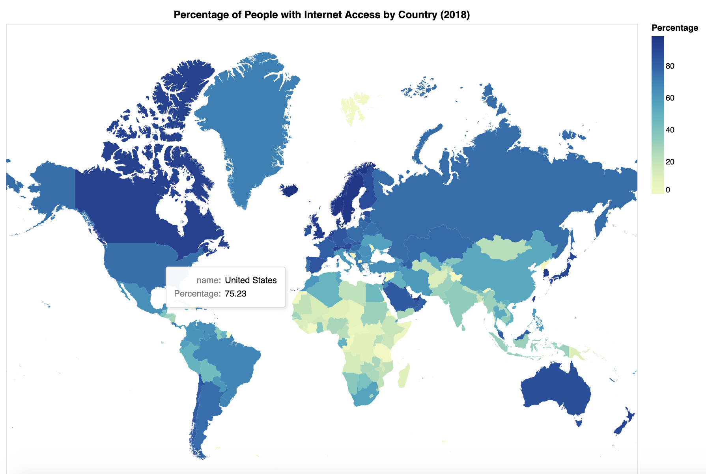
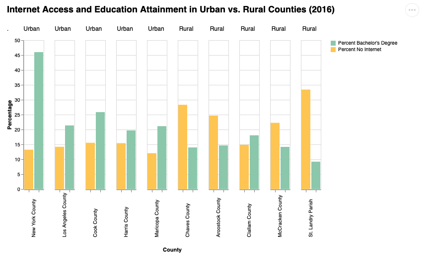

# Internet Access in the U.S. Across Different Demographics
###### Melody Zhu and Kristy Nhan
###### CSE 163 Final Project

## Results
#### 1. How has internet access in U.S. households, based on race, changed from 2015 to 2019?

#### 2. Where in the U.S. is access to the internet least prevalent?

#### 3. How does access to internet in the U.S. compare with global internet access?

#### 4. How does educational attainment relate to internet access?

#### 5. How has internet access in U.S. households, based on income, changed from 2015 to 2019?

## Reproducing Results
1. Clone this repository using:  
	`git clone https://github.com/melody078/internet-access-us.git`
2. Create an empty directory named 'data' inside the internet-access-us directory
3. Download all the necessary datasets from this Google Drive folder, and move all data files into the empty 'data' directory just created https://drive.google.com/drive/folders/1eLH4knOZ9dhRTQfkNmhycceGMTet6-zg?usp=sharing
4. Install pandas and geopandas if needed using:  
	`pip install pandas`  
	`pip install geopandas`
5. Install altair using:  
	`pip install altair`
6. Check that you are in the internet-access-us directory in the terminal  
7. Run entire project using:  
	`python src/main.py`  
	 and run the main.py Python file in the terminal
7. Each research question's visualization is saved as an html file in the internet-access-us directory, with a corresponding name (i.e. q1_chart.html). 
	* To view these visualizations, drag the html file out to a browser and view them in the browser.
	* Several of our visualizations are interactive--specifically, those for research questions 1, 3, and 5.
		Hover your mouse over various areas in these visualizations to display the exact data value at that corresponding location.